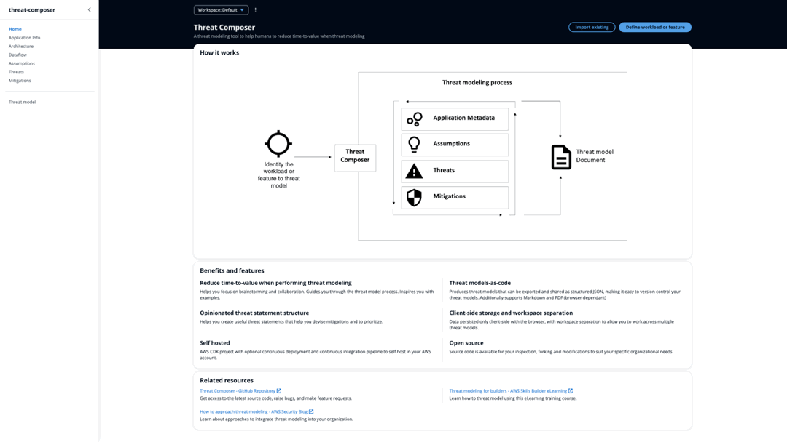

# ECS Project for Threat Composer App

This project deploys the Threat Composer application using Amazon Elastic Container Service (ECS) and Terraform, with automated CI/CD pipelines managed by GitHub Actions.

## Table of Contents

1. [Project Breakdown](#1-project-breakdown)
2. [App Demo](#2-app-demo)
3. [Local Setup](#3-local-setup)  
4. [Dockerfile Optimisation](#4-dockerfile-optimisation)  
5. [Terraform Infrastructure](#5-terraform-infrastructure)  
6. [CI/CD Pipelines with GitHub Actions](#6-cicd-pipelines-with-github-actions)  

## 1. Project Breakdown

This project consists of the following key components:

- A **Dockerised** application, built with an optimised multi-stage `Dockerfile`.
- An **Amazon ECS Fargate** service running behind an **Application Load Balancer**.
- A **modular Terraform** codebase managing the infrastructure, including **VPC**, **ECS**, **ALB**, and **Route 53** configurations.
- Enabled **SSL** using an **AWS Certificate Manager (ACM)** certificate for secure **HTTPS** access via the Application Load Balancer.
- **GitHub Actions** workflows for continuous integration and delivery.
- Integrated security scanning and static analysis using **Trivy**, **TFLint**, and **Checkov**.

## 2. App Demo

Threat Composer is a visual tool for designing threat models and identifying potential security risks early in the development process. This demo shows the core interface and functionality in action.



The application used in this project is open-source and maintained by AWS Labs. You can find the source repository here:  
[https://github.com/awslabs/threat-composer/tree/main](https://github.com/awslabs/threat-composer/tree/main)

## 3. Local Setup

To run the application locally:

```bash
yarn install
yarn build
yarn global add serve
serve -s build
```

Then open your browser and visit:
`http://localhost:3000`

## 4. Dockerfile Optimisation

The [Dockerfile](./Dockerfile) used to build the Threat Composer application's container image has been optimised for size and efficiency. Key optimisations include:

- **Multi-stage builds**: Reduces the final image size by including only necessary runtime dependencies.
- **Base image selection**: Uses a minimal base image such as `node:alpine` for smaller, faster builds.
- **Minimising unnecessary files**: Ensures only required files are copied into the final image.

## 5. Terraform Infrastructure

Terraform provisions and manages the complete AWS infrastructure. Key features include:

- **Remote state**: Terraform state is stored in an S3 bucket for persistence and collaboration.
- **Modular design**: Separate modules for VPC, ECS, ALB, and Route 53 improve reusability and clarity.
- **DRY principle**: Common config is abstracted into modules to avoid repetition.
- **Variable management**: Inputs and sensitive values are handled via `terraform.tfvars`.

## 5. CI/CD Pipelines with GitHub Actions

CI/CD is fully automated using GitHub Actions. The project includes four workflows to manage the container lifecycle and AWS infrastructure provisioning, with security and code quality checks integrated throughout:

- [**Build and Push Docker Image to ECR**](.github/workflows/docker-image.yml)
  Triggered on changes to the `Dockerfile` or the `app/` directory, or manually via the GitHub UI.  
  This workflow:
  - Builds the Docker image using the app’s `Dockerfile`
  - Scans for vulnerabilities using **Trivy**
  - Pushes the image to **Amazon ECR**, using credentials managed through GitHub Secrets

- [**Terraform Plan and Checks**](.github/workflows/tf-plan.yml)  
  Triggered on pull requests affecting the `terraform/` directory.  
  This workflow:
  - Downloads `terraform.tfvars` from **S3**
  - Runs `terraform init`, `fmt`, and `validate`
  - Lints the code with **TFLint** and performs static analysis using **Checkov**
  - Generates a plan file (`tfplan`) and uploads it as an artefact for later use

- [**Terraform Apply**](.github/workflows/tf-apply.yml)  
  Triggered automatically when a pull request with a `tf-plan` label is merged, or manually via the GitHub UI.  
  This workflow:
  - Retrieves the uploaded `tfplan` and `terraform.tfvars` from S3
  - Re-initialises Terraform and applies the plan using `terraform apply -auto-approve tfplan`

- [**Terraform Destroy**](.github/workflows/tf-destroy.yml)  
  Manually triggered when infrastructure needs to be torn down.  
  This workflow:
  - Pulls the latest `terraform.tfvars` from S3
  - Runs validation and linting with **TFLint**
  - Destroys all provisioned resources using `terraform destroy -auto-approve`

